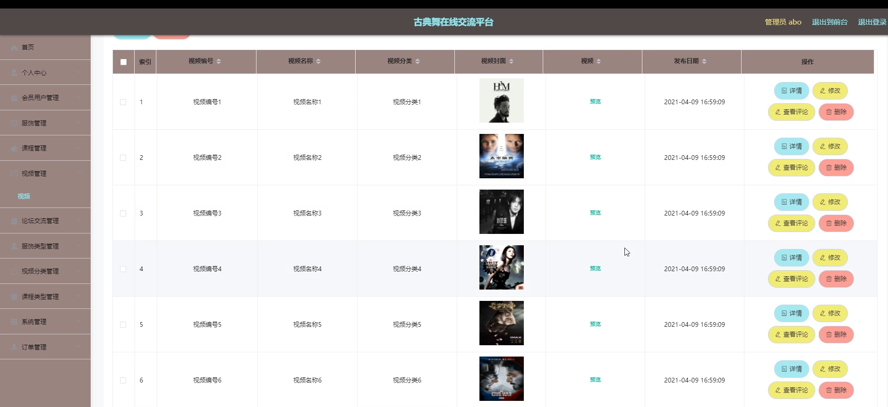

# 基于springboot的古典舞在线交流平台

---
### 👉作者QQ ：1556708905 微信：zheng0123Long (支持定制修改、部署调试、定制毕设)

### 👉接网站建设、小程序、H5、APP、各种系统等

---

#### 介绍

在数字化时代的浪潮下，古典舞这一传统文化形式正逐渐受到越来越多爱好者的关注。然而，随着爱好者群体的不断壮大，他们面临着学习资源分散、交流渠道不畅、购买途径有限等问题。为了解决这些问题，我们基于Spring Boot框架开发了一款古典舞在线交流平台。该平台旨在为广大古典舞爱好者提供一个集中、专业、便捷的在线服务，帮助他们更好地学习、交流和分享古典舞文化。

#### 技术栈
软件架构说明

#### 系统功能介绍

管理员角色功能模块  
个人中心：管理个人信息，设置和修改权限，确保管理员账号的安全与便捷使用。  
会员用户管理：全面管理用户信息，包括注册、审核、禁用/启用账号等，保障平台的用户质量和安全。  
服饰管理：负责服饰的添加、编辑、删除和库存管理，确保用户能够购买到心仪的古典舞服饰。  
课程管理：发布、编辑和删除古典舞课程，为爱好者提供丰富的学习资源。  
视频管理：上传、审核、删除教学视频，确保视频内容的质量和合规性。  
论坛交流管理：监控论坛动态，管理用户发布的帖子，维护论坛秩序。  
服饰类型、视频分类、课程类型管理：定义、修改和删除分类信息，方便用户查找和筛选。  
系统管理：配置系统参数，查看系统日志，确保平台的稳定运行。  
订单管理：处理用户提交的订单，包括服饰购买、课程报名等，提供优质的客户服务。  

用户角色功能模块  
服饰：浏览平台上的古典舞服饰，根据喜好进行筛选和购买。  
课程：查看平台上的古典舞课程，根据自己的需求选择报名学习。  
视频：观看平台上的教学视频，学习古典舞的技巧和动作。  
论坛交流：发布帖子分享自己的学习心得和体验，参与其他爱好者的讨论和交流。  
舞蹈资讯：获取最新的古典舞资讯，了解行业动态和趋势。  
个人中心：管理个人信息、订单、收藏等，方便用户管理自己的账户和购买记录。  
后台管理：管理个人收藏的服饰、课程、视频等，方便用户快速查找和访问。  
购物车：添加、查看、修改和结算购物车中的商品，提供便捷的购物体验。

#### 系统作用

管理员：作为平台的管理者，管理员负责整个平台的运营和维护。他们通过管理用户信息、发布课程内容、监控论坛交流等方式，确保平台的稳定、安全和高效运行。同时，管理员还需要处理用户订单、提供客户服务等，确保用户的满意度和忠诚度。

用户：作为古典舞爱好者，用户通过平台可以方便地获取到学习资源、交流机会和购买途径。他们可以浏览和购买心仪的古典舞服饰，报名参加感兴趣的课程，观看教学视频提升技能，还可以在论坛中与其他爱好者交流心得和经验。平台提供的个性化推荐和收藏功能也能帮助用户更好地管理自己的学习资源和兴趣点。

#### 系统功能截图

代码结构

数据库表

登录

用户管理

服装管理

课程管理

视频管理

论坛交流

系统管理

用户端后台页面

前台页面

订单管理

#### 总结

本古典舞在线交流平台基于Spring Boot框架开发，集成了服饰、课程、视频、论坛交流等多元化功能。通过管理员和用户两种角色的设置，平台能够满足不同用户的需求，提供全面、便捷、高效的在线服务。对于管理员来说，平台提供了强大的管理工具和手段，确保平台的稳定运行和优质服务；对于用户来说，平台提供了丰富的学习资源和交流机会，帮助他们更好地学习、交流和分享古典舞文化。

#### 使用说明

创建数据库，执行数据库脚本 修改jdbc数据库连接参数 下载安装maven依赖jar 启动idea中的springboot项目

后台地址：http://localhost:8080/springbootts2gs/admin/dist/index.html

管理员  abo 密码 abo

前台地址：http://localhost:8080/springbootts2gs/front/index.html

